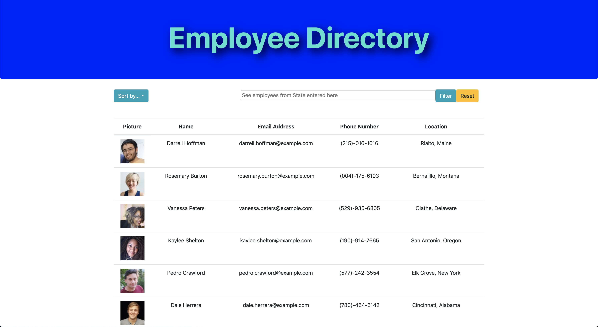

# Employee Directory

## Description

This is a web application that allows the user to view a comprehensive list of employee's, as well as their picture, email address, phone number, and city and state. It has the ability to sort the employee's by either their last names or state, or to filter by state.

## Link

Deployed application:
https://tranquil-atoll-72941.herokuapp.com

## Usage

In the project directory, you can run:

### `npm start`

Runs the app in the development mode. 
Open [http://localhost:3000](http://localhost:3000) to view it in the browser.

When you navigate to the page, you will see a full list of all employees. There is a dropdown with options to sort the list by either employee last name or by state, and you can also sort by these parameters by clicking on 'Name' and 'Location'. There is also an input field where you can filter the list by showing only employees in the state entered. Once filtered, the "Reset" button will bring the whole list back.

## Credits

http://www.uclaextension.edu

This app was created with React.

https://reactjs.org/

Bootstrap was used for easy formatting.

https://getbootstrap.com/

React-Bootstrap was also used for easy formatting.

https://react-bootstrap.github.io/

The randomuser api was used to generate random employees.

https://randomuser.me/

## Questions

For any questions you can send an email at angelodibellomusic@gmail.com

## Authors
UCLA Extension, Angelo Rocky Dibello
* [Portfolio](https://dibello80.github.io/AngeloRockyDibello-Portfolio/)
* [GitHub](https://github.com/Dibello80)
* [LinkedIn](https://www.linkedin.com/in/angelodibello)